### Hi there, I'm Aishith 👋

This is the place where i open source stuff and break things 🤣

- 🧑‍💻 I'm currently working on something cool 😎
- 🌱 I'm currently learning AI, ML & Data Science
- 🤖 I'm interested in Generative AI, Deep Learning & LLMs
- 💻 Ask me about Python/Java/AI/ML/Data Science/Software Development
- ⚡ Fun fact: **I enjoy turning ideas into working projects**


### 🌐 Connect with me

<p align="left">
  <a href="https://www.linkedin.com/in/aishith-karri">
    
  </a>
  <a href="https://github.com/aishith">
    
  </a>
</p>

### 🛠️ Languages and Tools

<p align="left">
  
  
  
  
  
  
  
  
  
  
  
  
</p>

<p align="left">
  
  
  
  
  
  
  
  
  
  
</p>

### 📊 This Week I Spent My Time On

<!--START_SECTION:waka-->

```txt
From: 18 September 2026 - To: 25 September 2026

Total Time: 0 secs

No activity tracked
```

<!--END_SECTION:waka-->

### 📈 GitHub Statistics

<p align="center">
  
  
</p>

### 🔥 GitHub Streak

<p align="center">

</p>

### 🐍 My Contribution Graph

<picture>
  <source
    media="(prefers-color-scheme: dark)"
    srcset="https://raw.githubusercontent.com/aishith/aishith/output/github-contribution-grid-snake-dark.svg"
  />

  <source
    media="(prefers-color-scheme: light)"
    srcset="https://raw.githubusercontent.com/aishith/aishith/output/github-contribution-grid-snake.svg"
  />

  
</picture>
